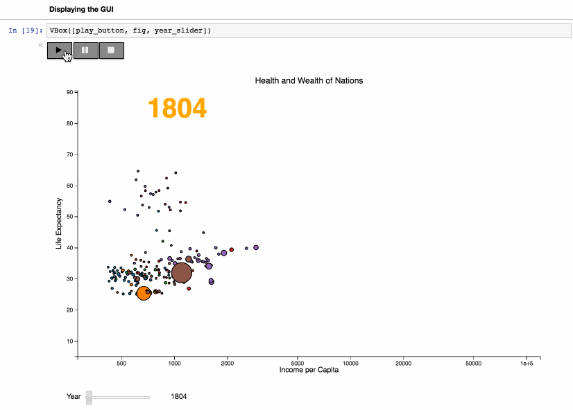
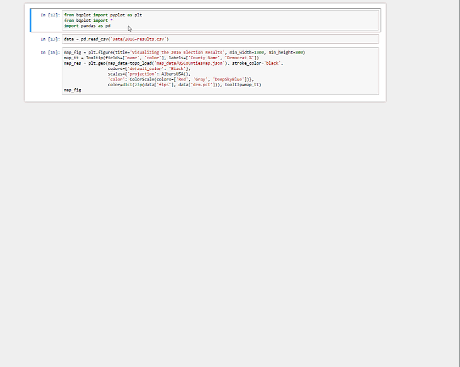

bqplot
======

bqplot is a Grammar of Graphics-based interactive plotting framework for the Jupyter notebook.

[](https://github.com/bloomberg/bqplot/blob/master/examples/Applications/Wealth%20of%20Nations.ipynb)

In bqplot, every single attribute of the plot is an interactive widget.
This allows the user to integrate any plot with IPython widgets to create a
complex and feature rich GUI from just a few simple lines of Python code.

For example, just a few lines of code allow us to generate an interactive map that visualizes the 2016 US Presidential County Level Results:



Goals
-----

-   provide a unified framework for 2-D visualizations with a pythonic API.
-   provide a sensible API for adding user interactions (panning, zooming, selection, etc)

Two APIs are provided

- Users can build custom visualizations using the internal object model, which
  is inspired by the constructs of the Grammar of Graphics (figure, marks, axes,
  scales), and enrich their visualization with our Interaction Layer.
- Or they can use the context-based API similar to Matplotlib's pyplot, which
  provides sensible default choices for most parameters.

Getting Started
---------------

### Try it online with [Binder](http://mybinder.org/)

[](http://mybinder.org:/repo/bloomberg/bqplot/notebooks/examples)

### Dependencies

This package depends on the following packages:

- `ipywidgets` (version >= 7.0.0)
- `traitlets` (version >= 4.3.0)
- `traittypes`
- `numpy`
- `pandas`


### Installation

Using pip:

```
$ pip install bqplot
$ jupyter nbextension enable --py --sys-prefix bqplot
```

Using conda

```
$ conda install -c conda-forge bqplot
```

For a development installation (requires npm (version >= 3.8) and node (version >= 4.0)):

```
$ git clone https://github.com/bloomberg/bqplot.git
$ cd bqplot
$ pip install -e .
$ jupyter nbextension install --py --symlink --sys-prefix bqplot
$ jupyter nbextension enable --py --sys-prefix bqplot
```

Note for developers: the `--symlink` argument on Linux or OS X allows one to
modify the JavaScript code in-place. This feature is not available
with Windows.

For the experimental JupyterLab extension, install the Python package, make sure the Jupyter widgets extension is installed, and install the bqplot extension:

```
$ pip install bqplot
$ jupyter labextension install @jupyter-widgets/jupyterlab-manager # install the Jupyter widgets extension
$ jupyter labextension install bqplot
```

### Loading `bqplot`

```python
# In a Jupyter notebook
import bqplot
```

That's it! You're ready to go!

Examples
--------

### Using the `pyplot` API

```python
from bqplot import pyplot as plt
import numpy as np

plt.figure(1, title='Line Chart')
np.random.seed(0)
n = 200
x = np.linspace(0.0, 10.0, n)
y = np.cumsum(np.random.randn(n))
plt.plot(x, y)
plt.show()
```

[](https://github.com/bloomberg/bqplot/blob/master/examples/Basic%20Plotting/Pyplot.ipynb)

### Using the `bqplot` internal object model


```python
import numpy as np
from IPython.display import display
from bqplot import (
    OrdinalScale, LinearScale, Bars, Lines, Axis, Figure
)

size = 20
np.random.seed(0)

x_data = np.arange(size)

x_ord = OrdinalScale()
y_sc = LinearScale()

bar = Bars(x=x_data, y=np.random.randn(2, size), scales={'x': x_ord, 'y':
y_sc}, type='stacked')
line = Lines(x=x_data, y=np.random.randn(size), scales={'x': x_ord, 'y': y_sc},
             stroke_width=3, colors=['red'], display_legend=True, labels=['Line chart'])

ax_x = Axis(scale=x_ord, grid_lines='solid', label='X')
ax_y = Axis(scale=y_sc, orientation='vertical', tick_format='0.2f',
            grid_lines='solid', label='Y')

Figure(marks=[bar, line], axes=[ax_x, ax_y], title='API Example',
       legend_location='bottom-right')
```

[](https://github.com/bloomberg/bqplot/blob/master/examples/Advanced%20Plotting/Advanced%20Plotting.ipynb)


Help / Documentation
--------------------

- API reference documentation: [](http://bqplot.readthedocs.org/en/stable/) [](http://bqplot.readthedocs.org/en/latest/)

- Talk to us on the `ipywidgets` Gitter chat: [](https://gitter.im/jupyter-widgets/Lobby?utm_source=badge&utm_medium=badge&utm_campaign=pr-badge&utm_content=badge)

- Send us an email at bqplot@bloomberg.net

License
-------

This software is licensed under the Apache 2.0 license. See the [LICENSE](LICENSE) file
for details.

