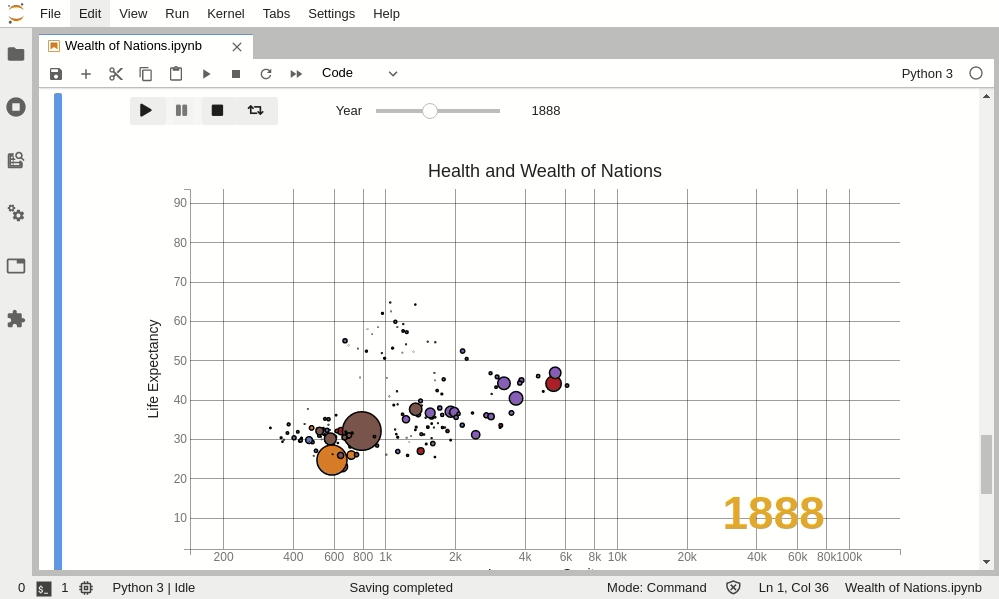

# bqplot

<picture>
  <source media="(prefers-color-scheme: dark)" srcset="https://raw.githubusercontent.com/bqplot/design/master/bqplot-logo-dark-nobackground.svg">
  <source media="(prefers-color-scheme: light)" srcset="https://raw.githubusercontent.com/bqplot/design/master/bqplot-logo-nobackground.svg">
  
</picture>

[](https://notebook.link/github/bqplot/bqplot/?path=examples%2FIndex.ipynb)

2-D plotting library for Project Jupyter

## Introduction

`bqplot` is a 2-D visualization system for Jupyter, based on the constructs of
the [*Grammar of Graphics*](https://en.wikipedia.org/wiki/Wilkinson%27s_Grammar_of_Graphics).

[](https://github.com/bqplot/bqplot/blob/master/examples/Applications/Wealth%20Of%20Nations/Bubble%20Chart.ipynb)

In `bqplot`, every component of a plot is an interactive widget. This allows the
user to integrate visualizations with other Jupyter interactive widgets to
create integrated GUIs with a few lines of Python code.

## Documentation

You can follow the documentation on https://bqplot.github.io/bqplot

## Trying it online

To try out `bqplot` interactively in your web browser, just click on the Notebook.link
link:

[](https://notebook.link/github/bqplot/bqplot/?path=examples%2FIndex.ipynb)

### Dependencies

This package depends on the following packages:

- `ipywidgets` (version >=7.0.0, <8.0)
- `traitlets` (version >=4.3.0, <5.0)
- `traittypes` (version >=0.2.1, <0.3)
- `numpy`
- `pandas`

### Installation

Using pip:

```bash
pip install bqplot
```

Using conda:

```bash
conda install -c conda-forge bqplot
```

**Note:** If you are using **JupyterLab <= 2**:

```bash
jupyter labextension install @jupyter-widgets/jupyterlab-manager bqplot
```

## Examples

### Using the `pyplot` API

[](https://github.com/bqplot/bqplot/blob/master/examples/Basic%20Plotting/Pyplot.ipynb)

### Using the `Object Model` API

[](https://github.com/bqplot/bqplot/blob/master/examples/Advanced%20Plotting/Advanced%20Plotting.ipynb)

## Install a previous bqplot version (only for JupyterLab <= 2)

In order to install a previous `bqplot` version, you need to know which front-end version (JavaScript) matches with the back-end version (Python).

For example, in order to install `bqplot` `0.11.9`, you need the labextension version `0.4.9`.

```bash
pip install bqplot==0.11.9
jupyter labextension install bqplot@0.4.9
```

Versions lookup table:

| `back-end (Python)` | `front-end (JavaScript)` |
|---------------------|--------------------------|
| 0.12.14             | 0.5.14                   |
| 0.12.13             | 0.5.13                   |
| 0.12.12             | 0.5.12                   |
| 0.12.11             | 0.5.11                   |
| 0.12.10             | 0.5.10                   |
| 0.12.9              | 0.5.9                    |
| 0.12.8              | 0.5.8                    |
| 0.12.7              | 0.5.7                    |
| 0.12.6              | 0.5.6                    |
| 0.12.4              | 0.5.4                    |
| 0.12.3              | 0.5.3                    |
| 0.12.2              | 0.5.2                    |
| 0.12.1              | 0.5.1                    |
| 0.12.0              | 0.5.0                    |
| 0.11.9              | 0.4.9                    |
| 0.11.8              | 0.4.8                    |
| 0.11.7              | 0.4.7                    |
| 0.11.6              | 0.4.6                    |
| 0.11.5              | 0.4.5                    |
| 0.11.4              | 0.4.5                    |
| 0.11.3              | 0.4.4                    |
| 0.11.2              | 0.4.3                    |
| 0.11.1              | 0.4.1                    |
| 0.11.0              | 0.4.0                    |

## Development

See our [contributing guidelines](CONTRIBUTING.md) for the development
installation, contributor workflow, and test commands.

## License

This software is licensed under the Apache 2.0 license. See the [LICENSE](LICENSE) file
for details.
