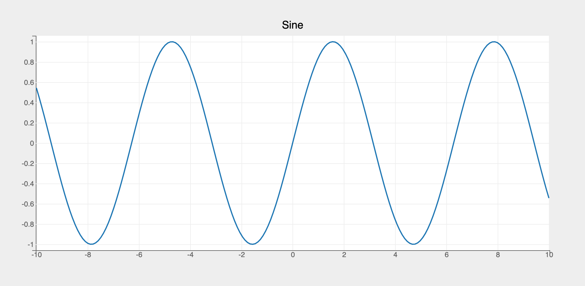
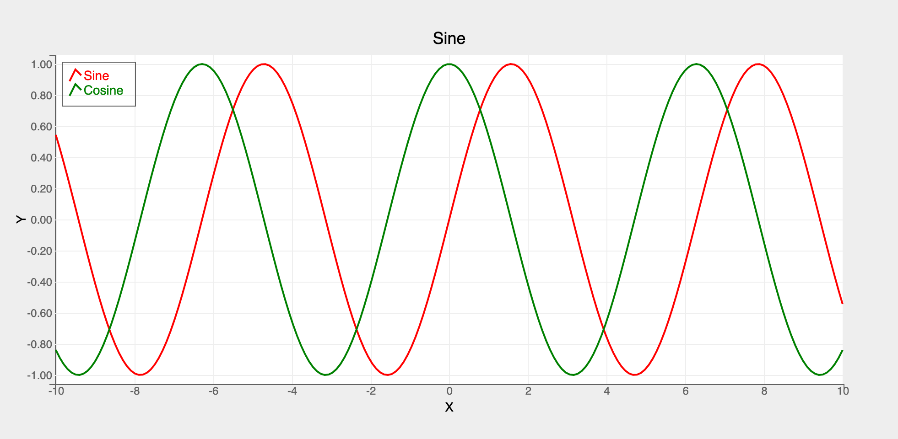

site_name: bqplot
site_description: bqplot: 2-D interactive visualization system for the Jupyter notebook
site_url: https://bqplot.github.io/

# bqplot


`bqplot` is a python based 2-D visualization system for Jupyter, based on the constructs of _Grammar of Graphics_. In `bqplot` every component of the plot is an interactive widget. This allows the user to seamlessly integrate `bqplot` with other Jupyter widgets to create rich visualizations by using just python code!

## Key Features

* __Core Plotting__ Support for core plotting is provided
* __Responsive__ Built using the same machinery that powers Jupyter widgets
    * Most of the attributes of `figure` and `mark` objects are implemented as [__traitlets__](https://traitlets.readthedocs.io/en/stable/) which make the plots respond to data updates. __After rendering the charts the attributes of the figures and marks can be updated in notebook cells down (or in callbacks) and changes are automatically reflected in the chart!__
* __Selectors__ Selectors enable selecting slices of data
    * __1D selectors__ Select slices of data along one dimension (x or y)
    * __2D selectors__ Select slices of data along two dimensions (x and y) using rectangular brushing
    * __Lasso__ Select slices of data along two dimensions (x and y) using a lasso
* __Jupyter Widget Integration__ Seamless integration and linking with Jupyter widgets
* __Extensibility__ `Object Model` can be extended to build re-usable compound plotting widgets and widget libraries
* __Dashboards/Apps__ Build rich interactive dashboards and apps by integrating `bqplot` with other Jupyter widget libraries and `voila` dashboarding tool

While `bqplot` provides support for static plotting for most of the chart types, it really shines in interactive plotting where data attributes are updated in an event-driven fashion (using ipywidgets, click handlers etc.)

## Python API
Two APIs are provided in bqplot:

* [__Pyplot__](usage/pyplot.md)
    * Context-based API similar to matplotlib's pyplot
    * Provides sensible default choices for most parameters
    * Concise API
    * Preferred API for most usecases

* [__Object Model__](usage/object-model.md)
    * Based on the constructs of Grammar of Graphics
    * Users need to explicitly create `Figure`, `Mark`, `Axis` and `Scale` objects
    * Verbose API
    * Fully customizable
    * Extensible


## Usage

### __pyplot__

`pyplot` is the best way to get started on `bqplot`. Creating a plot involves 3 steps:

  * Create a figure object
  * Create one or more marks (marks will be added to the above figure by default)
  * Render the figure which is an instance of `DOMWidget`

```py
import bqplot.pyplot as plt
import numpy as np

fig = plt.figure(title="Sine")

# create data vectors
x = np.linspace(-10, 10, 200)
y = np.sin(x)

# create line mark
line = plt.plot(x, y)

# renders the figure in the output cell (with toolbar for panzoom, save etc.)
plt.show()
```


### __Object Model__

`Object Model` is a verbose (but fully customizable) API for creating plots. Creating a plot involves the following steps:

* Create `scales` for data attributes (x, y, color etc.)
* Create `marks` using the above scales
* Create `axes` objects using the above scales
* Finally create the `figure` object and pass the `marks` and `axes` as parameters

```py
import numpy as np
import bqplot as bq

x = np.linspace(-10, 10, 200)
y = np.sin(x)

# create scales
xs = bq.LinearScale()
ys = bq.LinearScale()

# create mark objects
line = bq.Lines(x=x, y=y, scales={"x": xs, "y": ys})

# create axes objects
xax = bq.Axis(scale=xs, grid_lines="solid", label="X")
yax = bq.Axis(scale=ys, orientation="vertical", grid_lines="solid")

# create the figure object (renders in the output cell)
bq.Figure(marks=[line], axes=[xax, yax], title="Sine")
```


## Plot Enhancements
To enhance the plots (colors, grid lines, axes labels, ticks, legends etc.) you need to pass in additional parameters to the plotting widget constructors/methods. Let's look at an example:

```py hl_lines="1 7 8 9 10 14 15 16 17"
fig = plt.figure(title="Sine", legend_location="top-left")
x = np.linspace(-10, 10, 100)
# multi line chart
y = [np.sin(x), np.cos(x)]

# customize axes
axes_options = {
    "x": {"label": "X"},
    "y": {"label": "Y", "tick_format": ".2f"}
}
curves = plt.plot(
    x,
    y,
    colors=["red", "green"],
    display_legend=True,
    axes_options=axes_options,
    labels=["Sine", "Cosine"]
)
fig
```


## Next Steps
Have a look at [__Usage__](usage/pyplot.md) section for more details on how to configure and customize various plots
