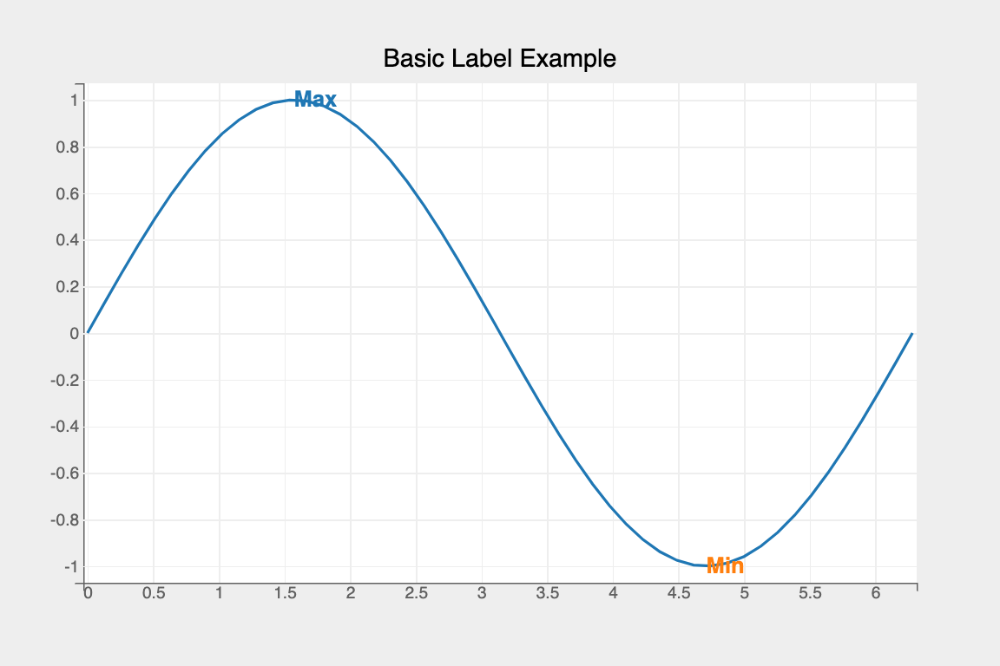
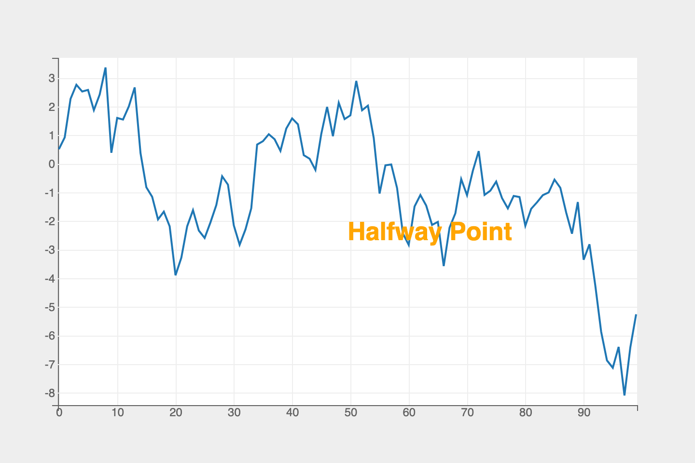
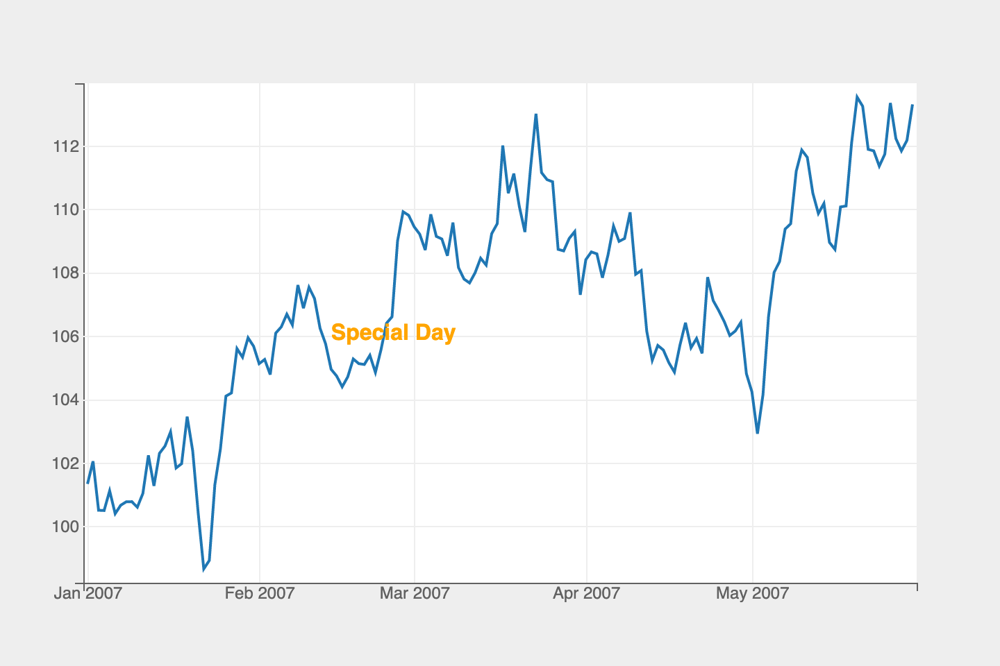

The `Label` mark provides the following features:

* Plot a single or multiple labels for an array of x-values and y-values

### Attributes

#### [Data Attributes](../../api/marks.md#bqplot.marks.Label--data-attributes)

#### [Style Attributes](../../api/marks.md#bqplot.marks.Label--style-attributes)


Let's now look at examples of adding labels using the `pyplot` API

### pyplot
The function for plotting labels in `pyplot` is [`plt.label`](../../api/pyplot.md#bqplot.pyplot.label). It takes three main arguments:

1. __text__ vector of text label values
2. __x__ vector of x values representing the x coordinates for the labels
3. __y__ vector of y values representing the y coordinates for the labels

For further customization, any of the attributes above can be passed as keyword args.

### Code Examples
#### Simple Label
```py
import numpy as np
import bqplot.pyplot as plt

fig = plt.figure(title="Basic Label Example")
x   = np.linspace(0, 2 * np.pi)
y   = np.sin(x)

line   = plt.plot(x, y)
label  = plt.label(
    text=["Max", "Min"],
    x=[.5 * np.pi, 1.5 * np.pi],
    y=[1, -1]
)
fig
```

!!! tip
    To render labels professionally it's better to offset the label to avoid obscuring the true graph below. To do so, set the `x_offset` and `y_offset` attributes (which accepts values in pixels), like so:
    ```py
    label.x_offset = 10
    label.y_offset = 10
    ```

Attributes can also be updated in separate notebook cells or in callbacks when an event is triggered!
```py
# update the label color
label.colors   = ['red', 'blue']
```

#### Figure Coordinates
Use the coordinates relative to the figure to more easily plot labels for important features.
```py
fig   = plt.figure()
y     = np.cumsum(np.random.randn(100))
line  = plt.plot(np.arange(y.size), y_data)
label = plt.label(
    ["Halfway Point"],
    default_size=26,
    font_weight="bolder",
    colors=["orange"]
)

label.x = [0.5]
label.y = [0.5]
```


Further, we can use values expressed in the units of the data. For example, if we consider a time series, we might want to label a specific date. Rather than calculating the position of the data with respect to the figure, we can simply pass in the date to the label function.
```py
fig = plt.figure()
y   = pd.Series(
    np.cumsum(np.random.randn(150)) + 100,
    name="Time Series",
    index=pd.date_range(start="01-01-2007", periods=150),
)

lines = plt.plot(y.index, y)
label = plt.label(["Special Day"],
                  x=[np.datetime64("2007-02-14")],
                  colors=["orange"])

labels.y = [0.5]
fig
```


#### Interactions
##### Movable Labels
Labels can be dynamically moved in the figure by enabling the `enable_move` flag attribute as shown below:
```
labels.enable_move = True
```

### Example Notebooks
For detailed examples of bar plots, refer to the following example notebooks

1. [pyplot](https://github.com/bqplot/bqplot/blob/master/examples/Marks/Pyplot/Label.ipynb)
2. [Object Model](https://github.com/bqplot/bqplot/blob/master/examples/Marks/Object%20Model/Label.ipynb)
