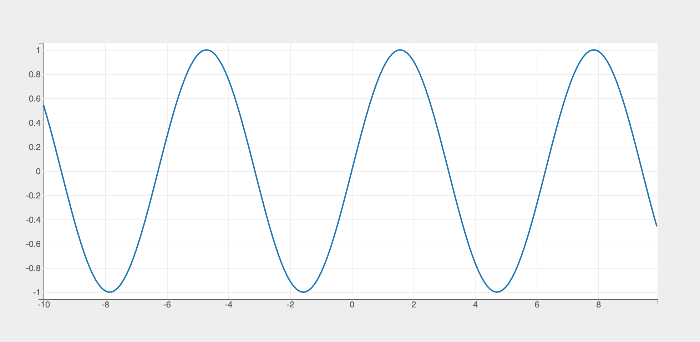
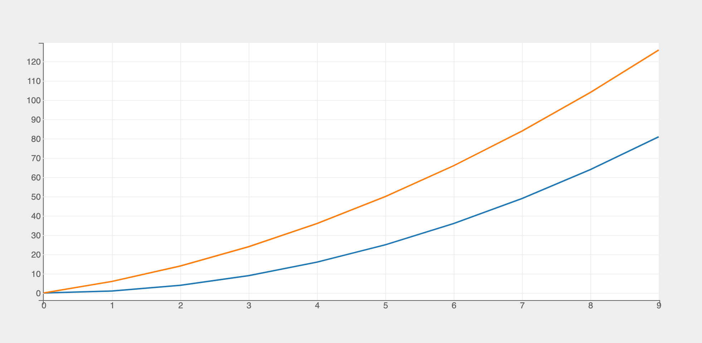
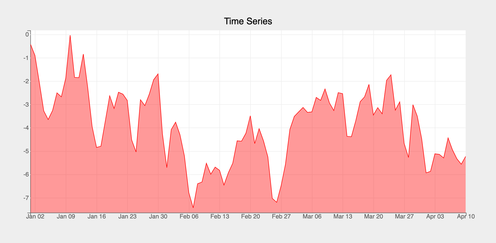
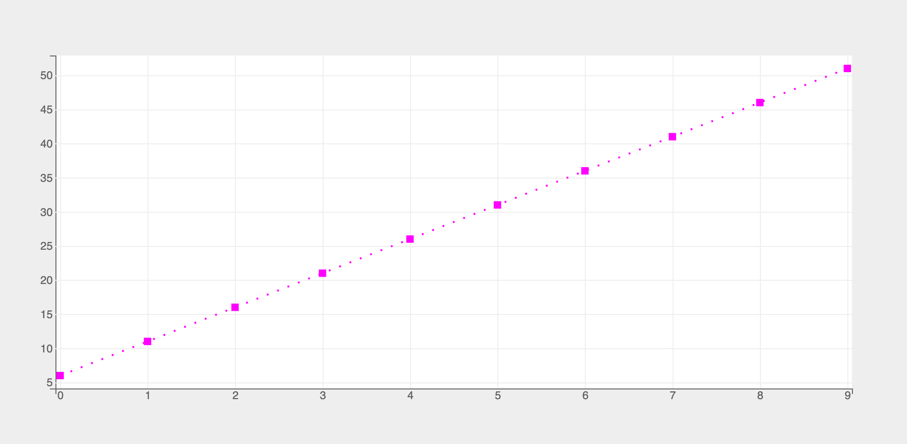
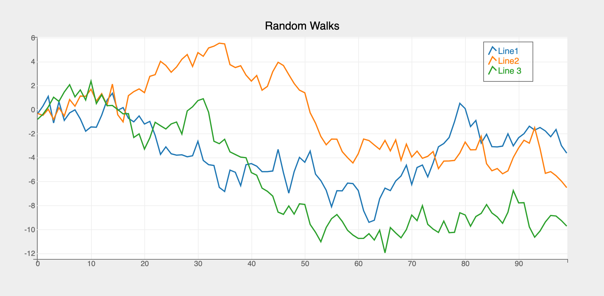
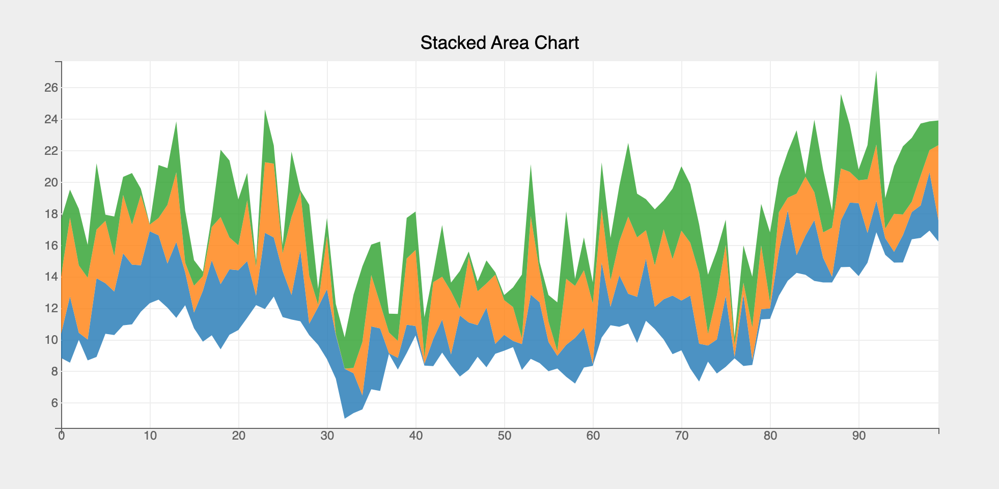

The Lines mark provides the following features:

* Plot a single or multiple arrays of y-values for a single or multiple arrays of x-values
* Style the line mark in different ways, by setting different attributes such as the colors, line_style, markers, stroke_width etc.
* Specify a marker at each point passed to the line. The marker can be a shape which is at the data points between which the line is interpolated and can be set through the `marker` attribute
* Fill lines with colors (in-between or below) to create __area__ charts

### Attributes

#### [Data Attributes](../../../api/marks/#bqplot.marks.Lines--data-attributes)

#### [Style Attributes](../../../api/marks/#bqplot.marks.Lines--style-attributes)
!!! tip "Note"
    Lines are implemented as __multi-line__ charts by default. Hence, style attributes like `colors`, `opacities` etc. are lists not strings!

### Line Styling
Following line styling options are supported:

* `colors`: color the line with a specific color. Note that `colors` is a list which supports multi-line charts by default!
* `line_style`: Following styling options are supported: {__solid__, __dashed__, __dotted__, __dash_dotted__}
* `marker`: Following marker options are supported: {__circle__, __cross__, __diamond__, __square__, __triangle-down__, __triangle-up__, __arrow__, __rectangle__, __ellipse__, __plus__, __crosshair__, __point__}

Let's now look at examples of constructing lines using `pyplot` API

### pyplot
The function for plotting lines is `pyplot` is `plt.plot`. It takes three arguments:

1. __x__ vector of x values
2. __y__ vector of y values. For multi-line chart `y` should be a list of arrays or a 2-d array
3. __marker_str__ _matplotlib_ style [marker strings](#marker-strings) for styling the lines

For further customization, any of the attributes above can be passed as keyword args.

### Code Examples
#### Simple Line Chart
```py
import bqplot.pyplot as plt
import numpy as np

fig = plt.figure()

x = np.arange(-10, 10, .1)
y = np.sin(x)
line = plt.plot(x, y)
fig
```



Attributes can be updated in separate notebook cells or in callbacks when an event is triggered!
```py
# update the line color and opacity
line.colors = ["red"]
line.opacities = [.5]
```
!!! tip "In Place Updates"
    The output cell containing the chart will be automatically updated whenever the figure or mark attributes are updated! The figure or marks should __never__ be recreated!

#### Multi Line Chart
To generate a multi-line chart `y` should be a __list__ of arrays or a 2d numpy array.
```py hl_lines="7"
import bqplot.pyplot as plt
import numpy as np

fig = plt.figure()

x = np.arange(10)
y = [x ** 2, x ** 2 + 5 * x]
line = plt.plot(x, y)
fig
```


#### Time Series
If the dates are of type `numpy.datetime64` then `pyplot` automatically infers a date scale for the `x` attribute. Otherwise a `DateScale` need to be explcitly specified using the `plt.scales` function

```py title="Time Series" hl_lines="12"
import bqplot as bq
import pandas as pd

import bqplot.pyplot as plt
import numpy as np

x = pd.date_range(start="2022-01-01", periods=100)
y = np.random.randn(100).cumsum()

fig = plt.figure(title="Time Series")
# create a date scale for x (not needed if dates are numpy.datetime64)
plt.scales(scales={"x": bq.DateScale()})
time_series_line = plt.plot(x, y, "r", stroke_width=1,
                            fill="bottom", # (1)!
                            fill_colors=["red"],
                            fill_opacities=[.4]))
fig
```

1. Adds a __fill__ below the line




#### Marker Strings
`pyplot` supports the following marker strings a la `matplotlib`.  Marker strings can be passed as a __third argument__ in `plt.plot` function.
Following codes are supported:

##### Color

| **Code** | **Value**  |
|--|--|
|__b__|blue|
|__g__|green|
|__r__|red|
|__c__|cyan|
|__m__|magenta|
|__y__|yellow|
|__k__|black|

##### Line Style
| **Code** | **Value**  |
|--|--|
|__:__|dotted|
|__-.__|dash_dotted|
|__--__|dashed|
|__-__|solid|


##### Marker
| **Code** | **Value**  |
|--|--|
|__o__|circle|
|__v__|triangle-down|
|__^__|triangle-up|
|__s__|square|
|__d__|diamond|
|__+__|+|
|__p__|cross|
|__x__|plus|
|__.__|crosshair|

To create a marker string you can combine the one or more of the the three types of codes above in any order, like so:

Let's look at a code example:
```py hl_lines="4"
fig = plt.figure()
x = np.arange(10)
y = 5 * x + 6
styled_line = plt.plot(x, y, "ms:") # (1)!
fig
```

1. Magenta dotted line with a square marker



!!! tip "Few more examples of marker strings"
    * __ms__ magenta line with square marker
    * __yo__ yellow line with circle marker
    * __--__ dashed line
    * __-.d__ dash-dotted line with diamond marker
    * __g+:__ green dotted line with plus marker

#### Legends
To display legends you need to set the following attributes of `plt.plot` function:

1. `labels`
2. `display_legend`

Let's look an example:
```py hl_lines="7 8"
fig = plt.figure(title="Random Walks")
x = np.arange(100)
# three random walks
y = np.random.randn(3, 100).cumsum(axis=1)
lines = plt.plot(
    x, y,
    labels=["Line1", "Line2", "Line 3"],
    display_legend=True
)
fig
```



!!! tip "Legend Location"
    Location of the legend can be configured by setting the attribute `legend_location` in the `figure` constructor, like so:
    ```py
    fig = plt.figure(legend_location="top-left")
    ```
#### Area Charts
Area charts can be constructed from line charts by passing in the following attributes:

* `fill`
* `fill_color`
* `fill_opacities`

```py hl_lines="12 13"
import bqplot as bq
import numpy as np

fig = plt.figure(title="Stacked Area Chart")
x = np.arange(100)
y1 = np.random.randn(100).cumsum() + 10
y2 = y1 + np.random.rand(100) * 5
y3 = y2 + np.random.rand(100) * 5
y4 = y3 + np.random.rand(100) * 5

lines = plt.plot(x, [y1, y2, y3, y4], stroke_width=0,
                 fill="between",
                 fill_opacities=[.8] * 4)
fig
```


### Example Notebooks
For detailed examples of plotting lines, refer to the following example notebooks:

1. [pyplot](https://github.com/bqplot/bqplot/blob/master/examples/Marks/Pyplot/Lines.ipynb)
2. [Object Model](https://github.com/bqplot/bqplot/blob/master/examples/Marks/Object%20Model/Lines.ipynb)