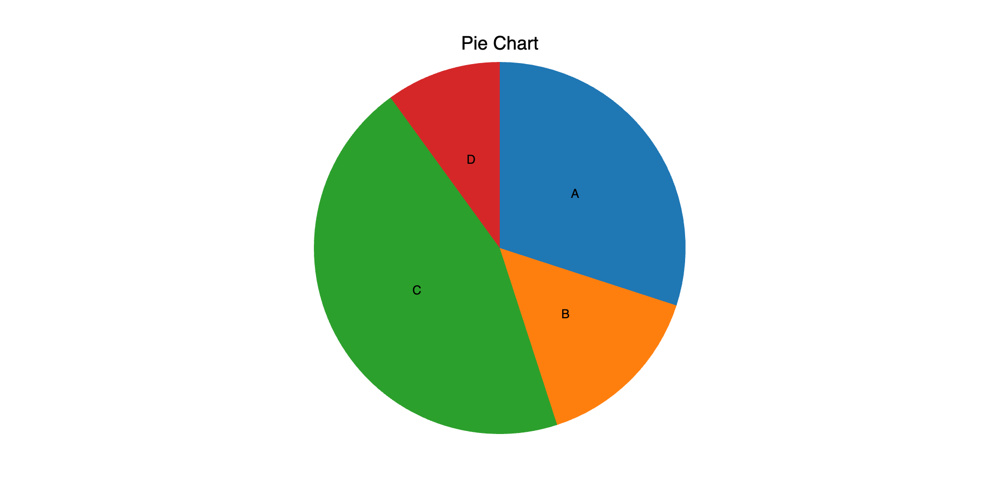
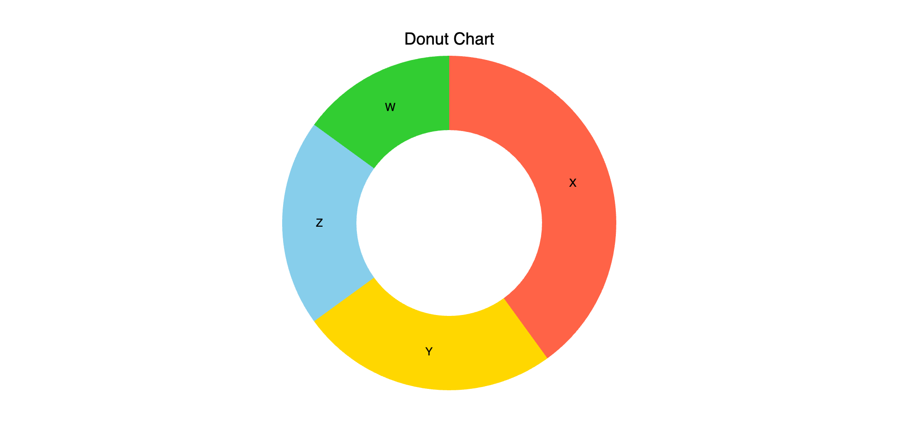
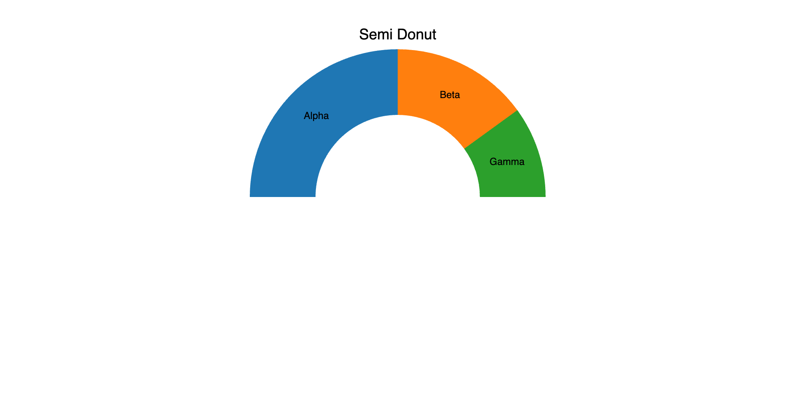
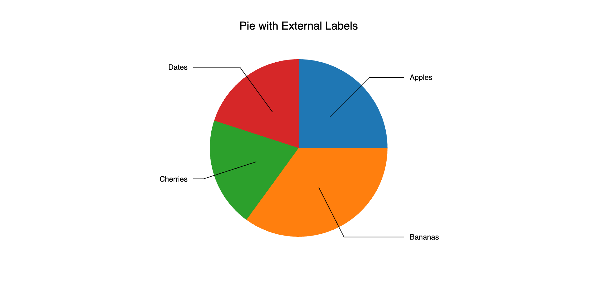

The `Pie` mark provides the following features:

* Plot pie and donut charts using a single array of values
* Supports categorical labels and tooltips
* Interactivity through selection, styling, and callbacks

### Attributes

#### [Data Attributes](../../api/marks.md#bqplot.marks.Pie--data-attributes)

#### [Style Attributes](../../api/marks.md#bqplot.marks.Pie--style-attributes)

Let's now look at examples of constructing pie charts using the `pyplot` API.

### pyplot
The function for plotting pie charts in `pyplot` is [`plt.pie`](../../api/pyplot.md#bqplot.pyplot.pie). It takes two main arguments:

1. __sizes__ – an array of numerical values representing the size of each slice
2. __labels__ – optional, a list of labels for the slices

For further customization, any of the attributes above can be passed as keyword args.

### Code Examples

#### Simple Pie Chart
```py hl_lines="9"
import bqplot.pyplot as plt
import numpy as np

fig = plt.figure(title="Pie Chart")

sizes = np.array([30, 15, 45, 10])
labels = ["A", "B", "C", "D"]

pie = plt.pie(sizes=sizes, labels=labels)

fig
```

 

!!! tip
    You can control the order of slices using the `sort` attribute, and customize the appearance using `colors`, `stroke`, and `opacities`.

#### Donut Chart

To create a donut chart, use the `inner_radius` attribute to make a hole in the center of the pie. As of now, the radius sizes are absolute, in pixels.

```py hl_lines="8"
fig = plt.figure(title="Donut Chart")

sizes = [40, 25, 20, 15]
labels = ["X", "Y", "Z", "W"]

pie = plt.pie(
    sizes=sizes, labels=labels,
    inner_radius=100, # radius in pixels
    colors=["tomato", "gold", "skyblue", "limegreen"]
)

fig
```



#### Styling Slices

Slices can be styled with colors, opacities, strokes, and more.

```py
pie.colors = ["orange", "cyan", "magenta", "lightgreen"]
pie.opacities = [0.8, 0.6, 0.9, 0.5]
pie.stroke = "white"
pie.stroke_width = 2
```

#### Tooltips

Tooltips can be added using the `tooltip` attribute with a [Tooltip](../../api/tooltip.md) instance.

```py hl_lines="6 7"
import bqplot as bq

fig = plt.figure()
sizes = [10, 30, 20, 40]
labels = ["Q1", "Q2", "Q3", "Q4"]
tooltip = bq.Tooltip(fields=["label", "size"])
pie = plt.pie(sizes=sizes, labels=labels, tooltip=tooltip)
fig
```

#### Selecting Slices

You can select slices using interactions. The `selected` attribute holds the list of selected indices.

!!! tip
    Use `selected_style` and `unselected_style` attributes to visually distinguish between selected and unselected slices.

```py hl_lines="6 7"
fig = plt.figure()
sizes = [10, 20, 30, 40]
labels = ["East", "West", "North", "South"]
pie = plt.pie(
    sizes=sizes,
    labels=labels,
    interactions={"click": "select"},
    unselected_style={"opacity": "0.4"}
)
def on_select(*args):
    selected = pie.selected
    if selected is not None:
        print("Selected slice(s):", [labels[i] for i in selected])

pie.observe(on_select, names=["selected"])

fig
```

You can also update the `selected` slices programmatically and the UI automatically updates itself.
```py
pie.selected = [1]

# clear selections
pie.selected = None
```

### Using Angles and Start Angle

Control the pie rotation or direction using the `start_angle` and `end_angle` attributes. Angles are measured in degrees with 0 being at 12'o clock.
Negative angles means you go anti-clockwise (for example, -90 means you are at 9'o clock).

```py hl_lines="11 12"
fig = plt.figure(title="Semi Donut")

sizes = [50, 30, 20]
labels = ["Alpha", "Beta", "Gamma"]

# start_angle and end_angle in degrees
pie = plt.pie(
    sizes=sizes,
    labels=labels,
    inner_radius=100,
    start_angle=-90,
    end_angle=90)

fig
```



#### Legends
When `labels` are provided, pie charts can display them as legends—either **inside**, **outside**, or not at all—based on the `display_labels` attribute.
The `display_labels` attribute is a `string` and accepts one of the following **three string values**:

* `'none'` — Do not display labels
* `'inside'` — Display labels inside the pie slices
* `'outside'` — Display labels outside the pie slices

#### Display Options

```py hl_lines="9"
fig = plt.figure(title="Pie with External Labels")

sizes = [25, 35, 20, 20]
labels = ["Apples", "Bananas", "Cherries", "Dates"]

pie = plt.pie(
    sizes=sizes,
    labels=labels,
    display_labels="outside" # Show labels outside slices
)

fig
```



#### Hide Labels

```py
pie.display_labels = "none"
```

#### Show Labels Inside Slices

```py
pie.display_labels = "inside"
```

#### Show Labels Outside Slices

```py
pie.display_labels = "outside"
```

!!! tip
    When displaying labels **outside** the chart, ensure there's enough room by increasing margins:

    ```py
    fig = plt.figure(fig_margin=dict(top=40, bottom=40, left=80, right=80))
    ```

### Example Notebooks

For detailed examples of pie charts, refer to the following example notebooks:

1. [pyplot](https://github.com/bqplot/bqplot/blob/master/examples/Marks/Pyplot/Pie.ipynb)
2. [Object Model](https://github.com/bqplot/bqplot/blob/master/examples/Marks/Object%20Model/Pie.ipynb)