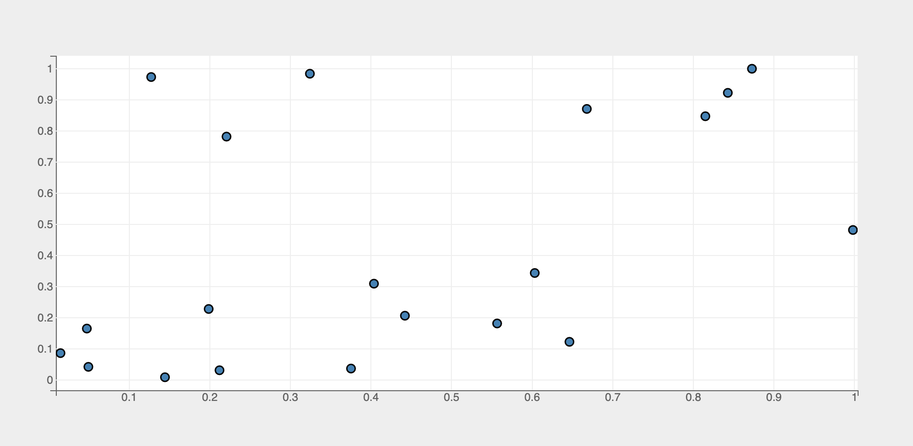
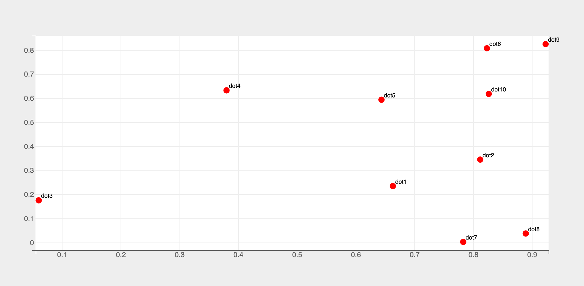
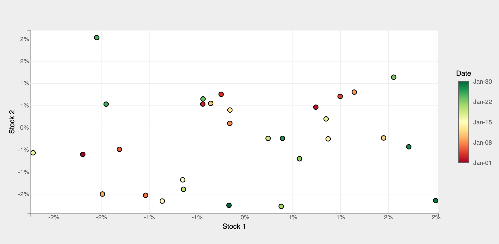

The Scatter mark provides the following features:

* Multi-dimensional scatter chart with with support for data attributes encoding `x`, `y`, `color`, `size` etc.
* Support for various marker types (circle, square, diamond etc.)
* Interactive updates with the ability to add new points by clicking on the chart, update points by moving the points etc.
* Filter data by using brush selectors

### Attributes

#### [Data Attributes](../../../api/marks/#bqplot.marks.Scatter--data-attributes)

#### [Style Attributes](../../../api/marks/#bqplot.marks.Scatter--style-attributes)

### pyplot
The function for plotting scatter charts in `pyplot` is [`plt.scatter`](../../api/pyplot.md#bqplot.pyplot.scatter). It takes two main arguments:

1. __x__ 1d array of x values
2. __y__ 1d array of y values

For further customization, any of the data/style attributes above can be passed as keyword arguments.

### Code Examples
#### Simple Scatter Chart
```py hl_lines="7"
import bqplot.pyplot as plt
import numpy as np

fig = plt.figure()

x, y = np.random.rand(2, 20)
scatter = plt.scatter(x, y, stroke="black")
fig
```

!!! tip
    Adding a black stroke around the dots renders them well


Attributes can be updated in separate notebook cells or in callbacks when an event is triggered!
```py
scatter.marker = "cross" # (1)!
scatter.fill = False # (2)!
```

1. make the marker `cross`
2. no fill inside the marker
!!! tip "In Place Updates"
    The output cell containing the chart will be automatically updated whenever the figure or mark attributes are updated! The figure or marks should __never__ be recreated!

#### Labels
Labels for dots can be added by using the `names` attribute

```py hl_lines="5"
fig = plt.figure()

x, y = np.random.rand(2, 10)
names = [f"dot{i+1}" for i in range(10)]
line = plt.scatter(x, y, colors=["red"], names=names, apply_clip=False)
plt.show()

```

!!! tip
    Setting the [Mark](../../api/marks.md) style attribute `apply_clip` to `False` prevents labels from getting clipped off the figure



#### Multiple Dimensions
Multiple dimensions can be encoded in a scatter chart by using additional [data attributes](../../../api/marks/#bqplot.marks.Scatter--data-attributes) like `size`, `color` etc.

Below is an example of a scatter plot of returns (dummy data) of two stocks with color encoding the chronology

```py hl_lines="15 16 17 21"
import pandas as pd

# prepare dummy returns data for two stocks
import pandas as pd

# prepare dummy returns data for two stocks
dates = pd.date_range(start="2023-01-01", periods=30)
returns = np.random.randn(30, 2) * 0.01
df = pd.DataFrame(returns, index=dates, columns=["Stock1", "Stock2"])

dates, returns1, returns2 = df.index, df["Stock1"], df["Stock2"]

fig = plt.figure(fig_margin=dict(top=60, bottom=60, left=60, right=120)) # (1)!

axes_options = {
    "x": dict(label="Stock 1", tick_format=".0%"),
    "y": dict(label="Stock 2", tick_format=".0%"),
    "color": dict( # (2)!
        tick_format="%b-%d", num_ticks=5, label="Date",
        orientation="vertical", side="right"
    ),
}
scatter = plt.scatter(
    returns1, returns2, color=dates,
    stroke="black",
    axes_options=axes_options,
)
fig
```

1. Provide enough right margin to accommodate the color bar
2. Color bar attributes



For a comprehensive example of encoding multi-dimensional data in a bubble chart, checkout the [Wealth Of Nations](https://github.com/bqplot/bqplot-gallery/blob/main/notebooks/wealth_of_nations/bubble_chart.ipynb) notebook in [`bqplot-gallery`](https://github.com/bqplot/bqplot-gallery).


#### Interactions
##### Tooltips
Tooltips can be added by setting the `tooltip` attribute to a [Tooltip](../../api/tooltip.md) instance

```py hl_lines="5 7"
import bqplot as bq

fig = plt.figure()
x, y = np.random.rand(2, 20)
tooltip = bq.Tooltip(fields=["x", "y"], formats=[".2f", ".2f"])
scatter = plt.scatter(x, y, colors=["green"], stroke="black",
                      tooltip=tooltip)
fig
```

##### Adding/Moving points
New points can be added by clicking on the chart and existing points can be moved using a mouse pointer. `x` and `y` data attributes will be __automatically__ updated as new points are added or existing points are moved around!

By implementing and registering callback functions we can achieve the desired behavior when points are added or updated.

=== "Add points"
    Set `interactions = {"click": "add"}` to add points on mouse clicks. `x` and `y` data attributes will be __automatically__ updated when new points are added!
    ```py hl_lines="4"
    fig = plt.figure()
    x, y = np.random.rand(2, 20)
    scatter = plt.scatter(x, y, colors=["green"], stroke="black",
                          interactions={"click": "add"})

    # callback to invoke when new points are added
    def on_add(*args):
        pass

    # register callback on x and y changes
    scatter.observe(on_add, names=["x", "y"])

    fig
    ```
=== "Update points"
    Set `enable_move=True` to move points. `x` and `y` data attributes will be __automatically__ updated as points are moved around!
    ```py hl_lines="4"
    fig = plt.figure()
    x, y = np.random.rand(2, 20)
    scatter = plt.scatter(x, y, colors=["green"], stroke="black",
                          enable_move=True)

    # callback to invoke when points are moved around
    def on_move(*args):
        pass

    # register callback on x and y changes
    scatter.observe(on_move, names=["x", "y"])

    fig
    ```
##### Selecting Points
Discrete points can be selected via mouse clicks or a continuous __region__ of points can be selected by using __Selectors__.
The `selected` attribute of scatter will be __automatically__ updated in both the cases. Note that `selected` attribute is a `list` of __indices__ of the selected points!

!!! tip
    Use the `selected_style` and `unselected_style` attributes (which are dicts) to apply CSS styling for selected and un-selected points respectively


Callbacks can be registered on changes to `selected` attribute.

=== "Discrete Selection"
    To select discrete set of points set `interactions = {"click": "select"}`. Single point can be selected by a mouse click. Mouse click + `command` key (mac) (or `control` key (windows)) lets you select multiple points.
    ```py hl_lines="4 5"
    fig = plt.figure()
    x, y = np.random.rand(2, 20)
    scatter = plt.scatter(x, y, colors=["green"], stroke="black",
                          interactions={"click": "select"},
                          unselected_style={"opacity": "0.3"})

    # callback to invoke when points are selected
    def on_select(*args):
        selected_indices = scatter.selected
        if selected_indices is not None:
            selected_x = scatter.x[selected_indices]
            selected_y = scatter.y[selected_indices]

            # do something with selected data

    # register callback on selected attribute
    scatter.observe(on_select, names=["selected"])

    fig
    ```

=== "Continous Region Selection"
    Use [BrushSelector](../../api/interactions.md#bqplot.interacts.BrushSelector) to select points in a rectangular region or a [Lasso Selector](../../api/interactions.md#bqplot.interacts.LassoSelector)
    to select points in a closed free-form region. Let's look at an example using a brush selector.

    Check [Selectors](../interactions/selectors.md) page for more details on how to setup and use various selectors.

    ```py hl_lines="9 10"
    import bqplot as bq

    fig = plt.figure()
    x, y = np.random.rand(2, 20)
    scatter = plt.scatter(x, y, colors=["green"], stroke="black",
                        unselected_style={"opacity": "0.3"})
    xs, ys = scatter.scales["x"], scatter.scales["y"]

    selector = bq.interacts.BrushSelector(x_scale=xs, y_scale=ys, marks=[scatter])
    fig.interaction = selector

    # callback to invoke when points are selected
    def on_select(*args):
        selected_indices = scatter.selected
        if selected_indices is not None:
            selected_x = scatter.x[selected_indices]
            selected_y = scatter.y[selected_indices]

            # do something with selected data

    # register callback on selected attribute
    scatter.observe(on_select, names=["selected"])

    fig
    ```

### Example Notebooks
For detailed examples of scatter plots, refer to the following example notebooks

1. [pyplot](https://github.com/bqplot/bqplot/blob/master/examples/Marks/Pyplot/Scatter.ipynb)
2. [Object Model](https://github.com/bqplot/bqplot/blob/master/examples/Marks/Object%20Model/Scatter.ipynb)