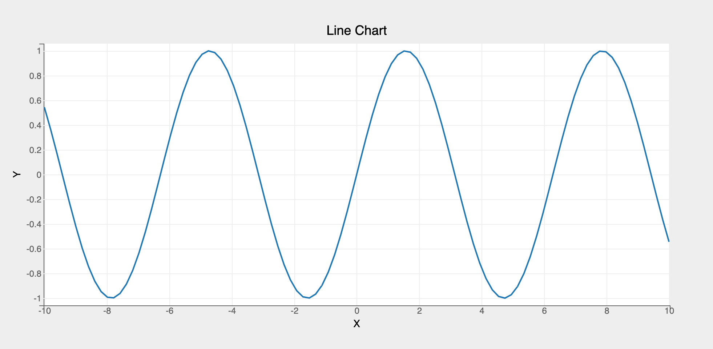
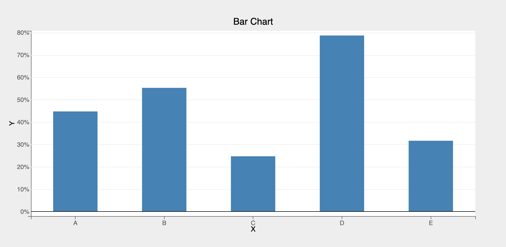
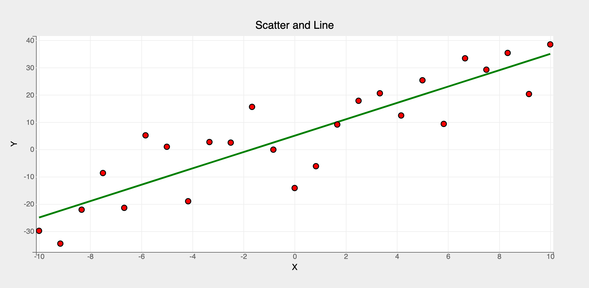

`bqplot` is based on _Grammar of Graphics_ paradigm. The Object Model provides the user an object-oriented interface for building plots. This means the API is verbose but fully customizable.

Following are the core components in the `Object Model`:

1. [Scales](../api/scales.md)
2. [Marks](../api/marks.md)
3. [Axes](../api/axes.md) 
4. [Figure](../api/figure.md)


The following are the steps to build a Figure in bqplot using the Object Model:

1. Build the scales for `x` and `y` quantities using the `Scale` classes (Scales map the data into pixels in the figure)
2. Build the marks using the `Mark` classes. Marks represent the core plotting objects (lines, scatter, bars, pies etc.). Marks take the scale objects created in step 1 as arguments
3. Build the axes for `x` and `y` scales
4. Finally create a figure using `Figure` class. Figure takes marks and axes as inputs. 
__Figure object is a instance of `DOMWidget` and can be rendered like any other jupyter widgets__

Let's look a few examples (`pyplot` usage available [here](pyplot.md)):

#### Line Chart
```py
# first, create two vectors x and y to plot using a Lines mark
import bqplot as bq
import numpy as np

x = np.linspace(-10, 10, 100)
y = np.sin(x)

# 1. Create the scales
xs = bq.LinearScale()
ys = bq.LinearScale()

# 2. Create the axes for x and y
xax = bq.Axis(scale=xs, label="X")
yax = bq.Axis(scale=ys, orientation="vertical", label="Y")

# 3. Create a Lines mark by passing in the scales
line = bq.Lines(x=x, y=y, scales={"x": xs, "y": ys})

# 4. Create a Figure object by assembling marks and axes
fig = bq.Figure(marks=[line], axes=[xax, yax], title="Line Chart")

# 5. Render the figure using display or just as is
fig
```


#### Bar Chart
For creating other marks (like scatter, pie, bars, etc.), only step 3 needs to be changed. Lets look a simple example to create a bar chart:
```py hl_lines="6 16"
# create two vectors x and y to plot a bar chart
x = list("ABCDE")
y = np.random.rand(5)

# 1. Create the scales
xs = bq.OrdinalScale()  # ordinal scale to represent categorical data
ys = bq.LinearScale()

# 2. Create the axes for x and y
xax = bq.Axis(scale=xs, label="X", grid_lines="none")  # no grid lines needed for x
yax = bq.Axis(
    scale=ys, orientation="vertical", label="Y", tick_format=".0%"
)  # note the use of tick_format to format ticks

# 3. Create a Bars mark by passing in the scales
bar = bq.Bars(x=x, y=y, scales={"x": xs, "y": ys}, padding=0.5)

# 4. Create a Figure object by assembling marks and axes
bq.Figure(marks=[bar], axes=[xax, yax], title="Bar Chart")
```


#### Multiple Marks
Multiple marks can be rendered in a figure. It's as easy as passing a list of marks when constructing the `Figure` object!
```py hl_lines="23"
x = np.linspace(-10, 10, 25)
y = 3 * x + 5
y_noise = y + 10 * np.random.randn(25)  # add some random noise to y

# 1. Create the scales
xs = bq.LinearScale()
ys = bq.LinearScale()

# 2. Create the axes for x and y
xax = bq.Axis(scale=xs, label="X")
yax = bq.Axis(scale=ys, orientation="vertical", label="Y")

# 3. Create a Lines and Scatter marks by passing in the scales
# additional attributes (stroke_width, colors etc.) can be passed as attributes 
# to the mark objects as needed
line = bq.Lines(x=x, y=y, scales={"x": xs, "y": ys}, colors=["green"], stroke_width=3)
scatter = bq.Scatter(
    x=x, y=y_noise, scales={"x": xs, "y": ys}, colors=["red"], stroke="black"
)

# 4. Create a Figure object by assembling marks and axes
# pass both the marks (line and scatter) as a list to the marks attribute
bq.Figure(marks=[line, scatter], axes=[xax, yax], title="Scatter and Line")
```


#### Summary

__Object Model__ is a verbose but fully customizable object-oriented API for plotting. Lower level constructs like scales, axes etc. have to explicitly constructed. 
For detailed usage refer to the [example notebooks](https://github.com/bqplot/bqplot/tree/master/examples/Marks/Object%20Model) using `Object Model`.

__Object Model__ can be used to build re-usable plotting widgets and widget libraries. More details can be found in [here]