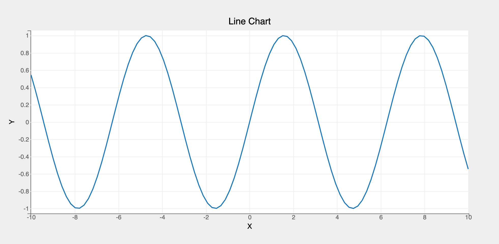
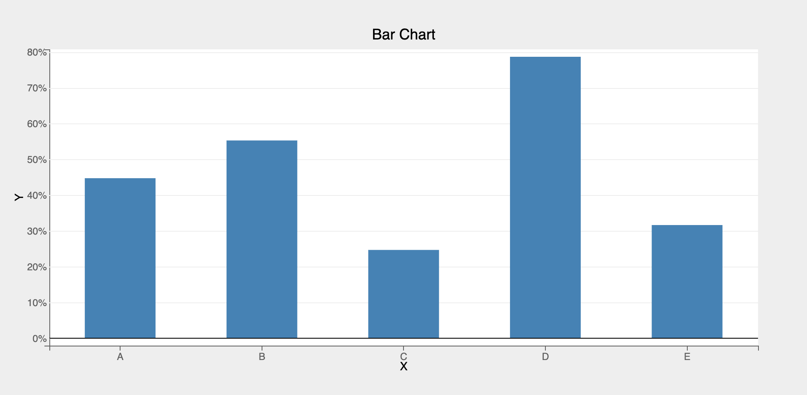
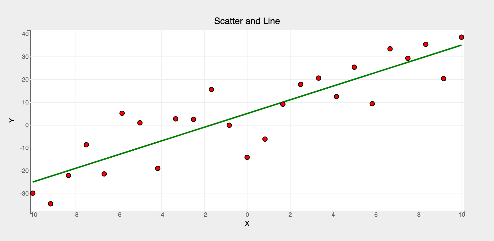

## `pyplot` API

`pyplot` is a context based functional API offering meaningful defaults. It's a concise API and very similar to matplotlib's pyplot. __Users new to bqplot should use `pyplot` as a starting point__. 

`pyplot` API documentation can be found [here](../api/pyplot.md).

Steps for building plots in `pyplot`:

1. Create a figure object using `plt.figure`
* (Optional steps)
    * Scales can be customized using `plt.scales` function (by default `LinearScale` instances are created for all data attributes)
    * Axes options can customized by passing a dict to axes_options argument in the marks' functions
* Create marks using pyplot functions like `plt.plot`, `plt.bar`, `plt.scatter` etc. (All the marks created will be automatically added to the figure object created in step 1)
* Render the figure object using the following approaches:
    * Using plt.show function which renders the figure in the current context along with toolbar for panzoom etc.
    * Using `display` on the figure object created in step 1 (toolbar doesn't show up in this case)

`pyplot` comes with many helper functions. A few are listed below:

* `plt.xlim`: sets the domain bounds of the current __x__ scale
* `plt.ylim`: sets the domain bounds of the current __y__ scale
* `plt.grids`: shows/hides the axis grid lines
* `plt.xlabel`: sets the X-Axis label
* `plt.ylabel`: sets the Y-Axis label
* `plt.hline`: draws a horizontal line at a specified level
* `plt.vline`: draws a vertical line at a specified level

Let's look at a few examples (`Object Model` usage available [here](object-model.md)):

#### Line Chart

```py
import bqplot.pyplot as plt
import numpy as np

# create data vectors x and y to plot using a Lines mark
x = np.linspace(-10, 10, 100)
y = np.sin(x)

# 1. Create the figure object
fig = plt.figure(title="Line Chart")

# 2. By default axes are created with basic defaults. If you want to customize the axes create
# a dict and pass it to axes_options argument in the marks
axes_opts = {"x": {"label": "X"}, "y": {"label": "Y"}}

# 3. Create a Lines mark by calling plt.plot function
line = plt.plot(
    x=x, y=y, axes_options=axes_opts
)  # note that custom axes options are passed to the mark function

# 4. Render the figure using plt.show() (displays toolbar as well)
plt.show()
```


#### Bar Chart

For creating other marks (like scatter, pie, bars, etc.), only step 2 needs to be changed. Lets look an example to create a bar chart:
```py  hl_lines="15"
# first, create data vectors x and y to plot a bar chart
x = list("ABCDE")
y = np.random.rand(5)

# 1. Create the figure object
fig = plt.figure(title="Bar Chart")

# 2. Customize the axes options
axes_opts = {
    "x": {"label": "X", "grid_lines": "none"},
    "y": {"label": "Y", "tick_format": ".0%"},
}

# 3. Create a Bars mark by calling plt.bar function
bar = plt.bar(x=x, y=y, padding=0.5, axes_options=axes_opts)

# 4. directly display the figure object created in step 1 (note that the toolbar no longer shows up)
fig
```


#### Multiple Marks

Multiple marks can be rendered in the same figure. It's as easy as creating marks one after another. They'll all be added to the same figure!

```py
# first, let's create two vectors x and y
x = np.linspace(-10, 10, 25)
y = 3 * x + 5
y_noise = y + 10 * np.random.randn(25)  # add some random noise to y

# 1. Create the figure object
fig = plt.figure(title="Scatter and Line")

# 3. Create line and scatter marks
# additional attributes (stroke_width, colors etc.) can be passed as attributes 
# to the mark objects as needed
line = plt.plot(x=x, y=y, colors=["green"], stroke_width=3)
scatter = plt.scatter(x=x, y=y_noise, colors=["red"], stroke="black")

# setting x and y axis labels using pyplot functions. Note that these functions
# should be called only after creating the marks
plt.xlabel("X")
plt.ylabel("Y")

# 4. render the figure
fig
```


#### Summary

__pyplot__ is a simple and intuitive API. It's available for all the marks except MarketMap. It should be used in almost all the cases by default since it offers a concise API compared to the Object Model. For detailed usage refer to the [mark examples using pyplot](https://github.com/bqplot/bqplot/tree/master/examples/Marks/Pyplot)
